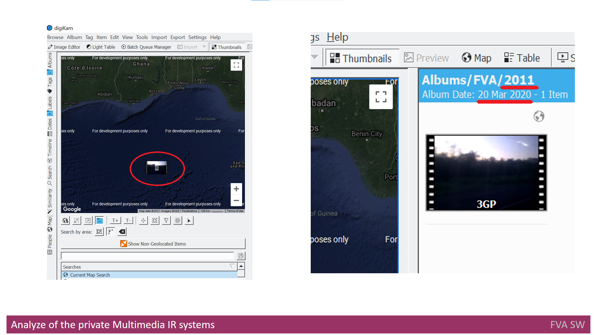

When I was a child I used to observe the family photo album to take a look at my relations who I have not seen in real life.
At that time we had film cameras only and so the amount of photos was not so big.
Time changed and right now let say almost everyone owns a camera or a smartphone with camera or even both.
Because of that the size of my photo album increased significally. But I don't think it is for me only.

Once Me and my friend decided to recall an event we both attended to. We took my photo album and tried to search there. 
That time my album kept more than 30 thousand items inside. That search process looked like

Of course we found nothing that time. And I started looking for a solution to search in [Multimedia Data](./MULTIMEDIADATA.md) in automatic way. 
What I found as a solution were the [Multimedia IR systems](./MULTIMEDIAIRSYSTEMS.md). 
But there are a lot of Multimedia IR Systems and there was a long way to choose one of them to start searching in more efficient way.
So the IR Multimedia Systems that are present on the market and available for end user were analyzed. 

Finally [digiKam](https://www.digikam.org/)  as Offline Multimedia IR System and [Synology Moments](https://www.synology.com/en-global/dsm/feature/moments)  as Online Multimedia IR System were chosen to use.     
Please notice they were chosen basing on author criteria only and there is no aim to advertise anyone.
You can find [here](./MULTIMEDIAIRSYSTEMSANALYZE.md) a description of the process of analyze and comparison for Multimedia IR Systems I have made to choose the most suitable system to me.
   

and Then I started using it... 
  What I found just immediatly there, that the current IR Multimedia systems don't provide a flexible and automated functionality to import the multimedia data into IR Multimedia systems.
But it was not last issue.
A short usage of these systems gives us understanding that Multimedia IR systems significantly rely on the multimedia metadata  as a main information source, that is used for the search by device, time, location, etc.  
So, the presence and consistency of metadata is very important for Multimedia IR systems to work and for other purposes [[21]](./REFERENCES.md).
The working experience with one of those systems shows that the search results might not be full or even incorrect due to inconsistent or not existing multimedia metadata.

Let us provide two examples of incorrect search results. 
In the first case, we tried to search for the photos with the existing Geo positions and to see them on a map. 
The search returned 4 photos taken near Ghana, marked by the red circle.

In fact, nobody has taken photos nearby Ghana.

In the second case, we searched for the photos taken in 2011. 
Actually, we got one video that, got recognized as of March 2020, which is underlined with the red color.

The system has provided such results due to incorrect metadata. 

The reasons for incorrect and absent metadata are rather different – from not setting proper data on the device that takes the photos to the privacy issues. 
This resource [[22]](./REFERENCES.md) describes the metadata importance in more details and there is information about other reasons of incorrect and absent metadata. 
So, automation for importing the new photo set into photo album is highly required feature for IR Multimedia systems as it can identify and address some issues that shall be fixed before user starts searching the data using IR Multimedia system. 
It should not implement any search function like search by emotions but it shall only support adding/fixing metadata at the import photo stage.

The available products on the market that help the end user to address those issues were checked. 
Those products were compared with the solution proposed.
The approaches and the tools that can help in project implementation were checked.
Two IR Multimedia Systems were verified if can easily be integrated with the proposed solution.

without organizer searchers not so effective
 link to questionary
And also basing on user search needs. 
