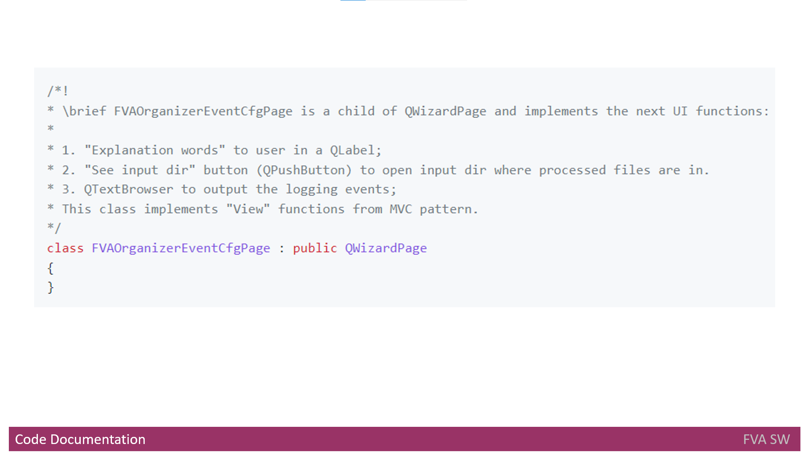

# Headline
TBD
What I learned as a Software Developer while creating my product
# Article description
TBD 

# Tags
TBD

# Content

## Code quality
&nbsp;&nbsp;&nbsp; Before creating the code we need to think about its quality. 
Yes, it's the first thing to start from.
So, we should be able to check code quality. 
It can be done automatically by cool tools (provided by third parties) mentioned [here](./CODEQUALITY.md).
Unfortunately, automatic tools do not check all rules I need and...
I decided to check other rules manually during [code review](./CODEREVIEW.md).
However, when I spent a lot of time on code reviewing and trying to check the code, I used **Python** to create other code [checks](../FVACodeChecks). 
Still, not every rule can be checked automatically, and manual effort is excpected. 

## Code documentation
"Hold on!", - you'll say. - "Are we going to start coding now?".
"Nope", - my answer will be.

&nbsp;&nbsp;&nbsp; Additionally, before creating the code we need to think about code documentation.
Since there are two languages used to create the **FVA Software**, there also should be: 
- **C++** [documentation rules](./CODEDOCUMENTATION.md) defined and
- **Python** documentation rules defined.

Therefore, I learned how to document the C++ code using **Doxygen** markdown and build documentation basing on Doxygen markdown. 
Oh my God, now I definitely know how to configure **Doxygen**.

## Implementation status
&nbsp;&nbsp;&nbsp; Before jumping into coding I thought about how I would know which requirement is covered and which is not.
In simple words, how tracing is going to be implemented.
What came up to my mind was a table with the following columns
- **Implemented**, yes or no
- **Feature ID**, an identifier from [features](../FVADocX/FVAToolSetFeatures.pptx)
- **Component**, component name
- **File names**, file names where implementation for this requirement is present
- **Description**, functional requirement description

Up to this point, I have **implementation status** for the following components:
- [Data processor](FVADataProcessor/IMPLEMENTATIONSTATUS.MD)
- [Configurator](FVAConfigurator/IMPLEMENTATIONSTATUS.MD)
- [Dictionary editor](FVADictionaryEditor/IMPLEMENTATIONSTATUS.MD)

## Implementation
&nbsp;&nbsp;&nbsp; Finally, we can move to coding!
I chose [QT](https://en.wikipedia.org/wiki/Qt_(software)) as the main library to use as **FVA Software** requires [UI](https://en.wikipedia.org/wiki/User_interface) and supports Windows, MacOS, Linux Ubuntu with the latest update.
To begin with, I used **QWidgets** and its children - **QWizard** and **QWizardPage**. 
But then I realized that using **QML** will be easier for [UI](https://en.wikipedia.org/wiki/User_interface) implementation.
Thus, my plan is to move to using **QML** but not **QWidgets**. 
I was suprised how easy it is to use [QT](https://en.wikipedia.org/wiki/Qt_(software)) for creation of the [player](../FVAPlayer) for Multimedia content. 
I'm going to use several [UI](https://en.wikipedia.org/wiki/User_interface) languages, and [QT](https://en.wikipedia.org/wiki/Qt_(software)) suggests to use the following: 

- [QTranslator](https://doc.qt.io/qt-5/qtranslator.html);
- [QtextCodec](https://doc.qt.io/qt-5/qtextcodec.html);
- [Qlocale](https://doc.qt.io/qt-5/qlocale.html);
- [QtextDecoder](https://doc.qt.io/qt-5/qtextdecoder.html);
- [QtextEncoder](https://doc.qt.io/qt-5/qtextencoder.html).

I was really glad to find out how easy it is to work with SQLlite with a help of [QT](https://en.wikipedia.org/wiki/Qt_(software)).
Nevertheless, I then moved from SQLlite to [CSV](../FVACommonLib/fvacsvfile.h) to keep the data. 

As I use two [languages](./PROGRAMMINGLANGUAGE.md), there was a need to work with **Python** code from **C++** application.
 
Last but not least, I learned how to create [riff parser](../FVACommonLib/fvariffparser.h).
                                                                
## Releasing code and docs

&nbsp;&nbsp;&nbsp; One more important point was a definition of [building and releasing the product and documentation](./BUILD_RELEASE.md) 
Here you can find a description for: 
- [Building the code](./BUILD_RELEASE.md#buildingthecode) 
- [Building the code using GitHub](./BUILD_RELEASE.md#buildingthecodeusinggithub)
- [Building the code locally](./BUILD_RELEASE.md#buildingthecodelocally)
- [Building the docs](./BUILD_RELEASE.md#buildingthedocs)

Thus, I learned:
- how to build and release documentation using GitHub;
- how to release product using GitHub.

# Definitions, Acronyms, Abbreviations
| # | Abbreviation or Acronym | Definition     |
| - | ------------------------|:--------------:|
| 1 | [Dictionary](https://en.wikibooks.org/wiki/A-level_Computing/AQA/Paper_1/Fundamentals_of_data_structures/Dictionaries)|A dictionary is a general-purpose data structure for storing a group of objects. A dictionary has a set of keys and each key has a single associated value. When presented with a key, the dictionary will return the associated value. |
| 2 | [Doxygen](https://en.wikipedia.org/wiki/Doxygen)| [Doxygen](https://en.wikipedia.org/wiki/Doxygen)  is a [documentation generator](https://en.wikipedia.org/wiki/Documentation_generator) and [static analysis](https://en.wikipedia.org/wiki/Static_analysis) tool for software [source trees](https://en.wikipedia.org/wiki/Source_code#Organization). When used as a documentation generator, Doxygen extracts information from specially-formatted comments within the code.|
| 3 | [exiftool](https://en.wikipedia.org/wiki/ExifTool)| ExifTool is a [free and open-source software](https://en.wikipedia.org/wiki/Free_and_open-source_software) program for reading, writing, and manipulating image, audio, video, and [PDF](https://en.wikipedia.org/wiki/Portable_Document_Format) [metadata](https://en.wikipedia.org/wiki/Metadata)|
| 4 | [IDE](https://en.wikipedia.org/wiki/Integrated_development_environment)| An integrated development environment (IDE) is a [software application](https://en.wikipedia.org/wiki/Application_software) that provides comprehensive facilities to [computer programmers](https://en.wikipedia.org/wiki/Computer_programmer) for [software development](https://en.wikipedia.org/wiki/Software_development). An IDE normally consists of at least a [source code editor](https://en.wikipedia.org/wiki/Source_code_editor), build [automation tools](https://en.wikipedia.org/wiki/Build_automation) and a [debugger](https://en.wikipedia.org/wiki/Debugger).|
| 5 | [Qt](https://en.wikipedia.org/wiki/Qt_(software))|is a [widget toolkit](https://en.wikipedia.org/wiki/Widget_toolkit) for creating [graphical user interfaces](https://en.wikipedia.org/wiki/Graphical_user_interfaces) as well as [cross-platform applications](https://en.wikipedia.org/wiki/Cross-platform) that run on various software and hardware platforms such as [Linux](https://en.wikipedia.org/wiki/Linux), [Windows](https://en.wikipedia.org/wiki/Windows), [macOS](https://en.wikipedia.org/wiki/MacOS), [Android](https://en.wikipedia.org/wiki/Android_(operating_system)) or [embedded systems](https://en.wikipedia.org/wiki/Embedded_system) with little or no change in the underlying codebase while still being a native application with native capabilities and speed. |
| 6 | [UI](https://en.wikipedia.org/wiki/User_interface)| is the space where interactions between humans and machines occur. The goal of this interaction is to allow effective operation and control of the machine from the human end, whilst the machine simultaneously feeds back information that aids the operators' [decision-making](https://en.wikipedia.org/wiki/Decision-making) process|