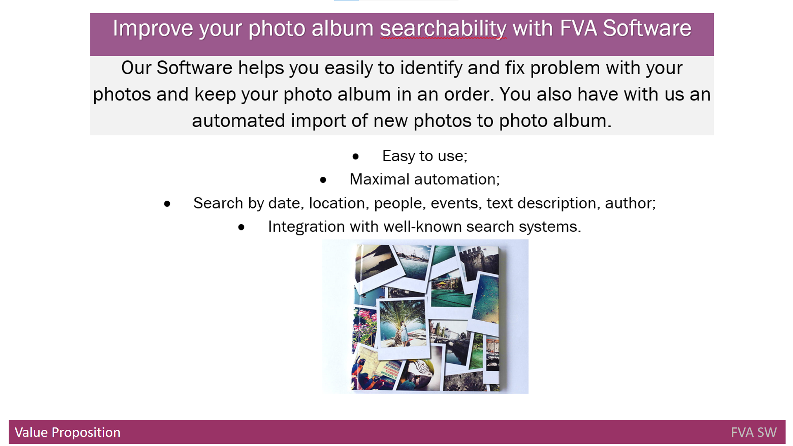
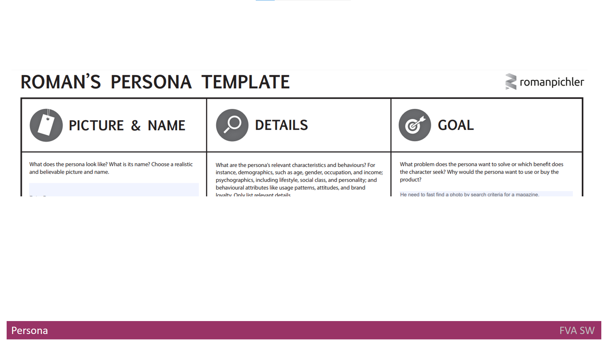
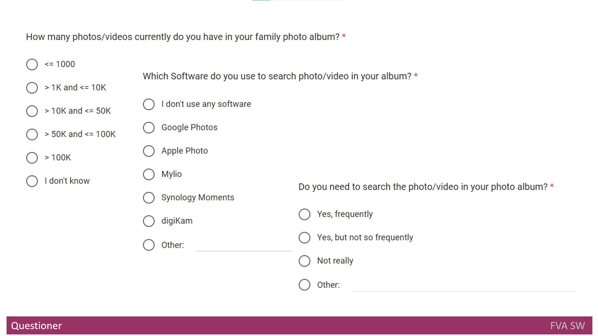

# What I learned as a Product Manager while creating my product
## Design Thinking
&nbsp;&nbsp;&nbsp; The first product I was thinking about was "FVA Tool Set".
Subsequently, another product came to my mind. As a result, a Product Line came about.

- "Hold on, you started from thinking of products, right?", - you will ask me.
- "Nope, I started from... It was ages ago and a whole [history](../README.md#history) is quite big. Being a developer, I started from coding".
- "Was it a good idea to start from coding?", - you will ask me. 
- "Again no. I would have started from [Design Thinking](../FVADocX/DesignThinking.pptx), if I was familiar with it." 

&nbsp;&nbsp;&nbsp; Design Thinking is a process of preparation, which consists of seven stages of creating a product:

- **Empathize-who, goal, do** Here you need to create an artifact called "Empathy Map" with a formula - who, goal, do;
- **Empathize-see, say, do, hear** Here you need to create an artifact called "Empathy Map" with a formula - see, say, do, hear;
- **Empathize-think and feel** Here you need to create an artifact called "Empathy Map" with a formula - think and feel;
- **Define: Problem Statement** Here you need to describe a problem basing on the "Empathy Map";
- **Ideate** Here you need to nave a list of raw ideas to explore.
- There are also other stages not mentioned here.

## High-level product documentation
&nbsp;&nbsp;&nbsp; Once I came up with product ideas to implement, I realized that a set of documentation artifacts to keep high-level product knowledge had to be established.

### Value Propositions
&nbsp;&nbsp;&nbsp; The first artifact to consider was [Value Proposition](../FVADocX/FVAToolSet-ValueProposition.docx)
which has the following components:
- **Mapper** for Products and Services to Customer Jobs;
- **Mapper** for Gain creators to Gains;
- **Mapper** for Pain relievers to Pains;
- **One Pager** with Value Proposition. 

### Business Model Canvas
&nbsp;&nbsp;&nbsp; The next artifact was [Business Model Canvas](../FVADocX/FVAToolSet-BusinessModelCanvas.docx). 
I downloaded a template [here](strategyzer.com) and filled in the following fields:
- **Key Partners** to answer the questions: **Who are the key partners? Who are the key suppliers?**
- **Key Activities** to answer the questions: **What are the main tasks that the company must do well to deliver its value?**
- **Key Resources** to answer the questions: **What are the most important physical, financial, intellectual or human recourses the company has?**
- **Value Propositions** to answer the questions: **What value do we deliver to the customer? Which customer needs do we want to satisfy?**
- **Customer Relationships** to answer the questions: **What type of relationship does each of the customer segments expect us to establish and maintain with them?**
- **Channels** to answer the questions: **Which channels do our customer segments want to be reached through? How do we reach them now?**
- **Customer Segments** to answer the questions: **Whom are we creating value for? Who are our most important customers?**
- **Revenue Streams** to answer the questions: **What value are our customers willing to pay for? What do they currently pay for? How do they pay? How would they prefer to pay?**
- **Cost Structure** to answer the questions: **Where do the costs come from?**

### Product Vision Board
&nbsp;&nbsp;&nbsp; The third artifact was [Product Vision Board](../FVADocX/FVAToolSet-ProductVisionBoard.pdf).
I downloaded a template [here](https://www.romanpichler.com/) and filled in the following fields:
- **VISION** to answer the questions: **What is your purpose for creating the product? Which positive change should it bring about?**
- **TARGET GROUP** to answer the questions: **Which market or market segment does the product address? Who are target customers and users?**
- **NEEDS** to answer the questions: **What problem does the product solve? Which benefit does it provide?**
- **PRODUCT** to answer the questions: **What kind of product is it? What makes it stand out? Is it feasible to develop the product?**
- **BUSINESS GOALS** to answer the questions: **How is the product going to benefit the company? What are business goals?**

### Competitive Analysis Matrix
&nbsp;&nbsp;&nbsp; The last artifact in High-level product documentation was [Competitive Analysis Matrix](../FVADocX/FVAToolSet-CompetetitiveAnalysisMatrix.pdf)
I filled in the following rows for several products:
- **Vision** with **Goal and Target segment**;
- **Marketing** with **Pricing and  Unique value proposition**;
- **End user support** with **Trainings, User guide and Help desk**;
- **Features**.

## Product from user prospective
&nbsp;&nbsp;&nbsp; As soon as high-level product documentation was ready, I decided to go deeper with more detail from the user's point of view.

### Persona 
&nbsp;&nbsp;&nbsp; The first artifact I created was [Persona](../FVADocX/FVAToolSet-Persona.pdf)
I downloaded a template [here](https://www.romanpichler.com/) and filled in the following fields:
- **PICTURE & NAME** to answer the questions: **What does the persona look like? What is his/her name?.** I chose a realistic and plausible picture and name.
- **DETAILS** to answer the questions: **What are persona’s relevant characteristics and behaviors?** I wrote in demographics, such as age, gender, occupation, and income; psychographics, including lifestyle, social class, and personality; and behavioral attributes like usage patterns, attitudes and brand loyalty.
- **GOAL** to answer the questions: **What problem does persona want to solve or which benefit does the character seek? Why would persona want to use or buy the product?**

### User Journey
&nbsp;&nbsp;&nbsp; Then I tried to restore user way to achieve the goals. 
And I came up with [User Journey](../FVADocX/FVAToolSet-UserJourney.pptx)

### User Scenarios 
To show the value of the product, I created three user scenarios and posted them on Youtube: 
- [Without FVA Tool Set](https://youtu.be/_bLXFdIDZtA)
- [With FVA Tool Set](https://youtu.be/-xnUsO7zW2s)
- [Checking the results of processing](https://youtu.be/NIsVYyioDnM)

### Stakeholders
&nbsp;&nbsp;&nbsp; Honestly, a bit later I realized that end users are not the only target audience for this product.
And next artifact - [Stakeholders](../FVADocX/FVAToolSet-Stakeholders.pptx) - came into sight.
It looks like a table with the following columns: Group, Stakeholder Role, Concerns, View.
Table rows contain as follows: End users, Suppliers and Team members.

## Product requirements 
&nbsp;&nbsp;&nbsp; Having defined everything from the user's point of view, I started thinking what exactly the product will implement.

### Questionnaire
&nbsp;&nbsp;&nbsp; Having no clue what is important for the user and what is not, I created a [questionnaire to clarify user needs](https://docs.google.com/forms/d/1EI3oOumRnHxDjEYgV6PFB-AMfV5plLtuV2r5S8BYn_g/).
It is a form to gather information on what capabilities, functions and scenarious are important. 

 
### Capabilities
&nbsp;&nbsp;&nbsp; Having gained an understanding of user needs, I started describing [Capabilities](./REQUIREMENTS.md#capabilities)
Literally, Capabilities describe key requirements.

### Features
&nbsp;&nbsp;&nbsp; Having capability list defined, I started preparing [features](../FVADocX/FVAToolSetFeatures.pptx).
They represent significant, central functionality of the final system. 
I put them into the table with the following columns: Name, Clarification, Business Value.
The feature set helped me to create a project plan and a road map. 

### Functional Requirements
&nbsp;&nbsp;&nbsp; Last but not least step in defining product behavior was a list of [Functional Requirements](../FVADocX/FunctionalRequirements.xlsx),
that define system detail behavior.
I settled them into the table with the following columns: Name, Architecture complexity, Business Value, Component, Phase, Feature ID.

## Product development documents

### Product Road Map
&nbsp;&nbsp;&nbsp; I believe, [Product Road Map](../FVADocX/FVAToolSet-ProductRoadMap.pdf) is the most important document for a product at the development stage. 
I downloaded a template [here](https://www.romanpichler.com/) and filled in the following fields and rows:
- **DATE** with **Release date or timeframe**;
- **NAME** with **Name of new release**;
- **GOAL** with **The benefit a product should provide**;
- **FEATURES** with **High-level features necessary to meet the goal**;
- **METRICS** with **Metrics to determine if the goal has been met**.
Columns there are the product different version.

On the top of that, it is quite convenient to keep an [online roadmap](https://github.com/dimanikulin/fva/projects/4).

## Links for product people (FVA Helpers)
&nbsp;&nbsp;&nbsp; - [Information with Business Goals/Drivers/Objectives](../FVADocX/FVAHelpers.pptx)
FVAHelpers-BusinessModelCanvas.docx
