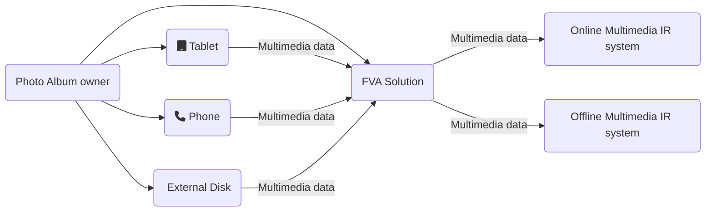

The context diagram below shows the solution bounds and its interactions with other objects and subjects.

The solution is used during import of new multimedia content from external devices to an existing user photo album. 
The photo album owner is the main and only user of the solution. 
The external devices might be: the phones with a camera, the tablets with a camera, the photo/video cameras, external storages (e.g., hard drive or flash card) with multimedia data, etc. 
Once the multimedia data from the external devices is processed, the solution interacts with integrated online and offline Multimedia systems.
