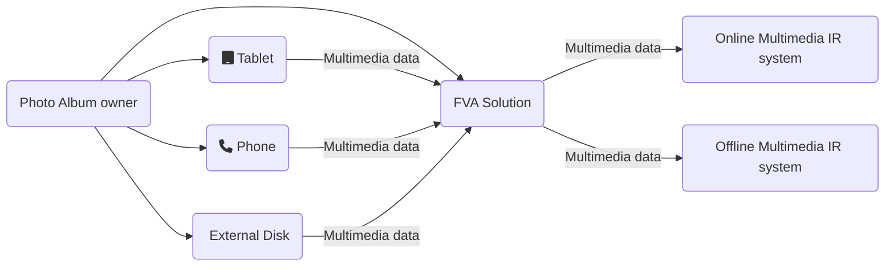

&nbsp;&nbsp;&nbsp; The context diagram below shows the solution bounds and its interactions with other objects and subjects.

&nbsp;&nbsp;&nbsp; The solution is used during import of new multimedia content from external devices to an existing user photo album. 
 
&nbsp;&nbsp;&nbsp; The photo album owner is the main and only user of the solution. 
 
&nbsp;&nbsp;&nbsp; The external devices might be: 
* the phones with a camera; 
* the tablets with a camera; 
* the photo/video cameras;
* external storages (e.g., hard drive or flash card) with multimedia data;
* etc.
  
&nbsp;&nbsp;&nbsp; Once the multimedia data from the external devices is processed, the solution interacts with integrated online and offline Multimedia systems.

# Definitions, Acronyms, Abbreviations
| # | Abbreviation or Acronym | Definition     |
| - | ------------------------|:--------------:|
| 1 | [Multimedia data](https://link.springer.com/referenceworkentry/10.1007%2F978-0-387-39940-9_1008)| Multimedia in principle means data of more than one medium. It usually refers to data representing multiple types of medium to capture information and experiences related to objects and events. Commonly used forms of data are numbers, alphanumeric, text, images, audio, and video. In common usage, people refer a data set as multimedia only when time-dependent data such as audio and video are involved.|
| 2 | Multimedia IR| Multimedia Information Retrieval (MIR) is an organic system made up of Text Retrieval (TR); Visual Retrieval (VR); Video Retrieval (VDR); and Audio Retrieval (AR) systems. So that each type of digital document may be analyzed and searched by the elements of language appropriate to its nature, search criteria must be extended.|
