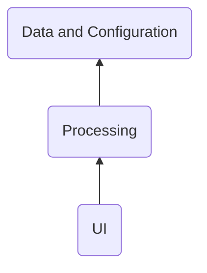
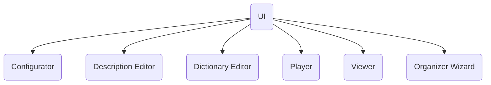
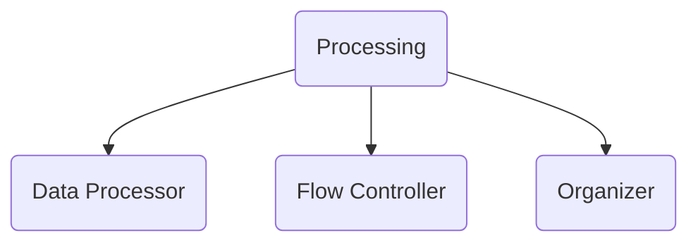
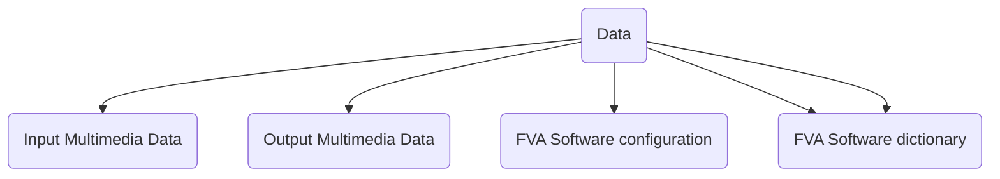

# Layers
&nbsp;&nbsp;&nbsp; The Layered Architecture shall be applied to the system. 
TBD why not SOA
Following layers are considered:


</br> TBD - describe why layered arch </br> 
All the main components interact with the Logging component to log the important events during processing.

## Logging 
&nbsp;&nbsp;&nbsp; During logging the logging component uses a "log level" setting got from FVAConfigurator.
The log shall be present as a CSV file with name of component it was created by.
The format of log file shall be following:
TBD
 
# ([UI](https://en.wikipedia.org/wiki/User_interface))layer 
The photo album owner interacts with the system through the user interface ([UI](https://en.wikipedia.org/wiki/User_interface)) layer components. 
Basing on flow and user needs, [UI](https://en.wikipedia.org/wiki/User_interface) interacts with other components described later.


## Configurator
The main function of the Configurator is to provide the settings to other components when requested and to save/load them to/from data layer.
Configurator works directly with saved in the disk settings. 
Instead, it uses FvaConfiguration.

## Description Editor
TBD 

## Dictionary Editor
TBD 

## Player
TBD 

## Viewer
TBD 

## Organizer Wizard
TBD 

# Processing layer

&nbsp;&nbsp;&nbsp; The purpose of Flow Controller is to manage the action flows between [UI](https://en.wikipedia.org/wiki/User_interface) and the Data processor. The flows can be configured by the Configurator component.
</br>
&nbsp;&nbsp;&nbsp; Data Processor performs such actions as checking the multimedia [Metadata](https://en.wikipedia.org/wiki/Metadata) for presence and consistency and enriching it.
</br>
&nbsp;&nbsp;&nbsp; Organizer makes possible to start any command in separate process from command line or in separate thread.
</br>

# Data layer

## Input Multimedia Data
TBD

## Output Multimedia Data
TBD

## FVA Software configuration
TBD
The formatting strings shall be kept in a separated category

## FVA Software internal metadata
&nbsp;&nbsp;&nbsp; It is used to enrich Output Multimedia Data. </br> 
&nbsp;&nbsp;&nbsp; Let describe how it was before current implementation. 
Firstly it was kept at file system level inside of the Photo Album. 
Each folder in the Photo Album could keep two files: “folderDescription.json” and “description.csv”. 
“FolderDescription.json” kept information about all the files under a folder that was common. 
For example it could be device id that was the same for all multimedia files.   “FolderDescription.json” structure was:
</br>
```json
{
"deviceId":"",
"tags":"",
"people": "",
"place":"",
"event":"" 
}
```

“folderDescription.json” example:
```json
{
"deviceId":"3",
"tags":"At home, with a family",
"people": "3,6,8",
"place":"3,4",
"event":"45"
}
```

&nbsp;&nbsp;&nbsp; Description.csv has been used to keep information about files under a folder for cases if some multimedia files had different internal metadata. 
“description.csv” structure was:
</br>
&nbsp;&nbsp;&nbsp; Name,Place,People,Device,WhoTook,Description,Scaner
</br>
&nbsp;&nbsp;&nbsp; So the FVA software created or updated these files during import new files to photo album. </br> 
&nbsp;&nbsp;&nbsp; Keeping the internal metadata in this approach did not give good flexibility and maintainability. 
So adding one column in “folderDescription.json” or “description.csv” could cause whole photo album file system structure to update.
</br> 
&nbsp;&nbsp;&nbsp; So it was decided to move all “folderDescription.json” and “description.csv” to SQLlite database. 
The scheme has been created to keep the same information as “folderDescription.json” and “description.csv” did keep.
The FVA software created SQL updates to DB during import new files to photo album and all those SQL updates were kept to create SQL at any time.
</br>
&nbsp;&nbsp;&nbsp; Again keeping the internal metadata in this approach did not give good flexibility and maintainability. 
So merging one folder in photo album to another caused significant change of SQL updates.
</br>
&nbsp;&nbsp;&nbsp; So it was decided to move all information in one CSV file.
That internal metadata file does not keep information in which folder a file is kept. 
So merging one folder in photo album to another does not cause an issue.
Still the duplication of information takes place because for all files in one folder common information is just copied.
</br>

## FVA Software dictionary 
FVA Software dictionary is data used along with FVA Software internal metadata.

# Definitions, Acronyms, Abbreviations
| # | Abbreviation or Acronym | Definition     |
| - | ------------------------|:--------------:|
| 1 | CLT                     |Command Line Task |
| 2 | [Dictionary](https://en.wikibooks.org/wiki/A-level_Computing/AQA/Paper_1/Fundamentals_of_data_structures/Dictionaries)|A dictionary is a general-purpose data structure for storing a group of objects. A dictionary has a set of keys and each key has a single associated value. When presented with a key, the dictionary will return the associated value. |
| 3 | [JSON](https://www.json.org/json-en.html)| JSON (JavaScript Object Notation) is a lightweight data-interchange format.|
| 4 | [Multimedia data](https://link.springer.com/referenceworkentry/10.1007%2F978-0-387-39940-9_1008)| Multimedia in principle means data of more than one medium. It usually refers to data representing multiple types of medium to capture information and experiences related to objects and events. Commonly used forms of data are numbers, alphanumeric, text, images, audio, and video. In common usage, people refer a data set as multimedia only when time-dependent data such as audio and video are involved.|
| 5 | [metadata](https://en.wikipedia.org/wiki/Metadata)|Metadata is "data that provides [information](https://en.wikipedia.org/wiki/Information) about other data". In other words, it is "data about data." Many distinct types of metadata exist, including descriptive metadata, structural metadata, administrative metadata, reference metadata and statistical metadata. |
| 6 | [SOA](https://en.wikipedia.org/wiki/Service-oriented_architecture)|Service-oriented architecture (SOA) is an architectural style that supports service orientation. By consequence, it is as well applied in the field of [software design](https://en.wikipedia.org/wiki/Software_design) where services are provided to the other components by [application components](https://en.wikipedia.org/wiki/Application_components), through a [communication protocol](https://en.wikipedia.org/wiki/Communications_protocol) over a network. | 