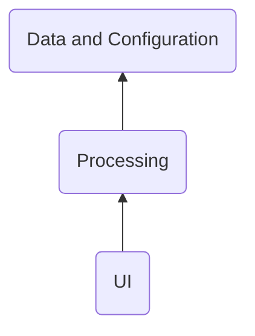
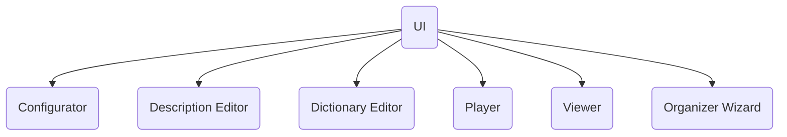
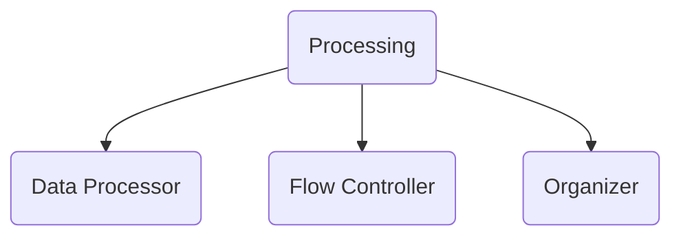

&nbsp;&nbsp;&nbsp; The Layered Architecture shall be applied to the system. 
Following layers are considered:

  TBD - describe why layered arch   

# ([UI](https://en.wikipedia.org/wiki/User_interface))layer
 
The photo album owner interacts with the system through the user interface ([UI](https://en.wikipedia.org/wiki/User_interface)) layer components. 

Basing on flow and user needs, [UI](https://en.wikipedia.org/wiki/User_interface) interacts with other components described later.

# Processing layer

# Data layer

##################################################################
&nbsp;&nbsp;&nbsp; Below is a diagram to show :
- functional decomposition of the system; 
- the connections between the components; 
- the connections between the components and photo album owner;
- the connections between the components and external systems.
 
 