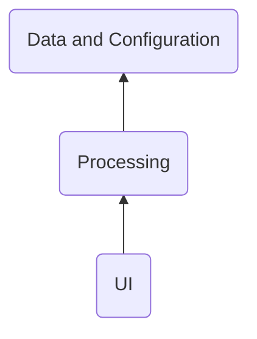
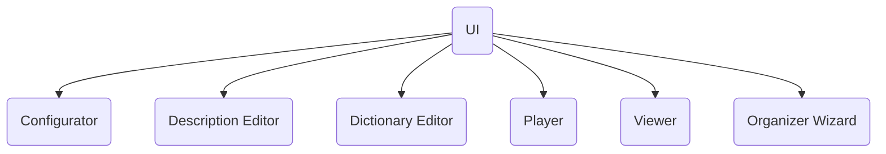
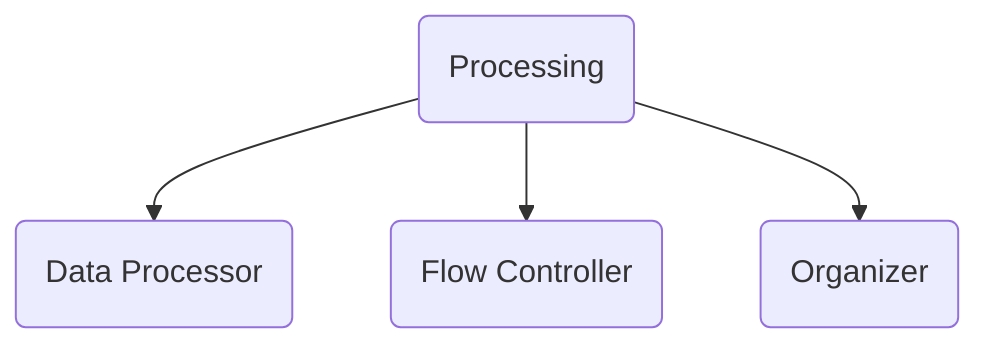

# Layers
&nbsp;&nbsp;&nbsp; The Layered Architecture shall be applied to the system. 
Following layers are considered:

  TBD - describe why layered arch   
All the main components interact with the Logging component to log the important events during processing.

## Logging 
&nbsp;&nbsp;&nbsp; During logging the logging component shall use a "log level" setting got from FVAConfigurator.
The log shall be present as a CSV file with name of component it was created by.
The format of log file shall be following:
TBD
 
# ([UI](https://en.wikipedia.org/wiki/User_interface))layer 
The photo album owner interacts with the system through the user interface ([UI](https://en.wikipedia.org/wiki/User_interface)) layer components. 
Basing on flow and user needs, [UI](https://en.wikipedia.org/wiki/User_interface) interacts with other components described later.

## Configurator
The main function of the Configurator is to provide the settings to other components when requested and to save/load them to/from data layer.
Configurator works directly with saved in the disk settings. 
Instead, it uses FvaConfiguration.

## Description Editor
TBD 

## Dictionary Editor
TBD 

## Player
TBD 

## Viewer
TBD 

## Organizer Wizard
TBD 

# Processing layer

&nbsp;&nbsp;&nbsp; The purpose of Flow Controller is to manage the action flows between [UI](https://en.wikipedia.org/wiki/User_interface) and the Data processor. The flows can be configured by the Configurator component.
 
&nbsp;&nbsp;&nbsp; Data Processor performs such actions as checking the multimedia [Metadata](https://en.wikipedia.org/wiki/Metadata) for presence and consistency and enriching it.
 
&nbsp;&nbsp;&nbsp; TBD - Organizer
 

# Data layer

##################################################################
&nbsp;&nbsp;&nbsp; Below is a diagram to show :
- functional decomposition of the system; 
- the connections between the components; 
- the connections between the components and photo album owner;
- the connections between the components and external systems.

 