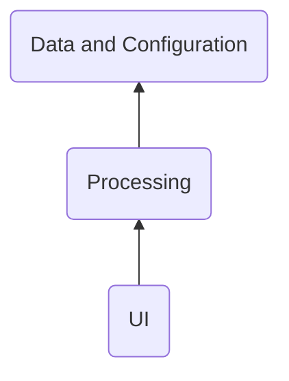

&nbsp;&nbsp;&nbsp; The Layered Architecture shall be applied to the system.  
Following layers are considered:
- Data and Configuration layer;
- Processing layer;
- [UI](https://en.wikipedia.org/wiki/User_interface) layer; 
TBD - describe why layered arch   

The photo album owner interacts with the system through the user interface ([UI](https://en.wikipedia.org/wiki/User_interface)) components. 
There are following ([UI](https://en.wikipedia.org/wiki/User_interface))layer's components:
- Configurator;
- Description Editor;
- Dictionary Editor;
- Player;
- Viewer;
- OrganizerWizard.
TBD - diagram

##################################################################
&nbsp;&nbsp;&nbsp; Below is a diagram to show :
- functional decomposition of the system; 
- the connections between the components; 
- the connections between the components and photo album owner;
- the connections between the components and external systems.
 

Basing on flow and user needs, [UI](https://en.wikipedia.org/wiki/User_interface) interacts with other main described below. 

There are following functional components of the system:
- Data Processor;
- Flow Controller;
- Organizer;

- Data.

