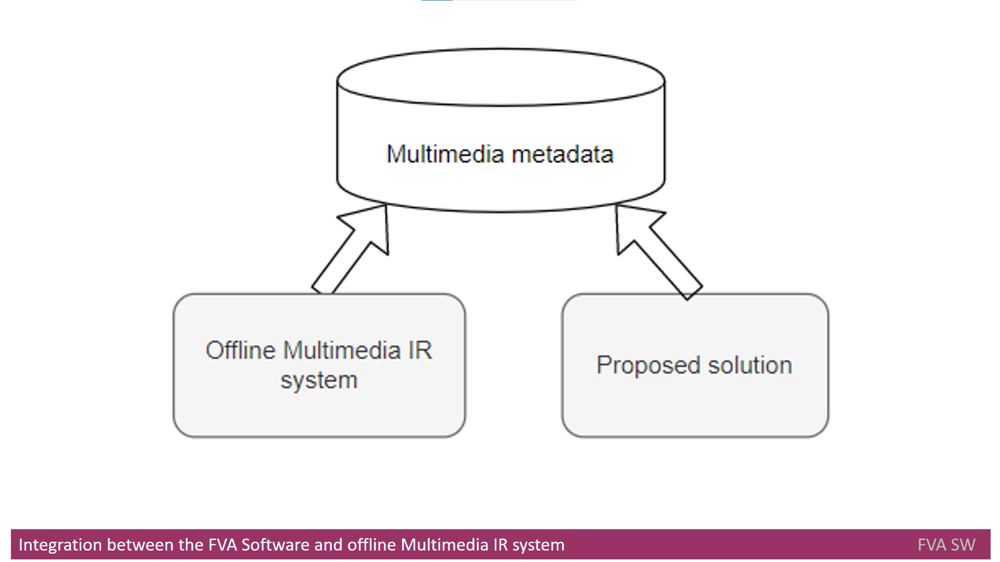
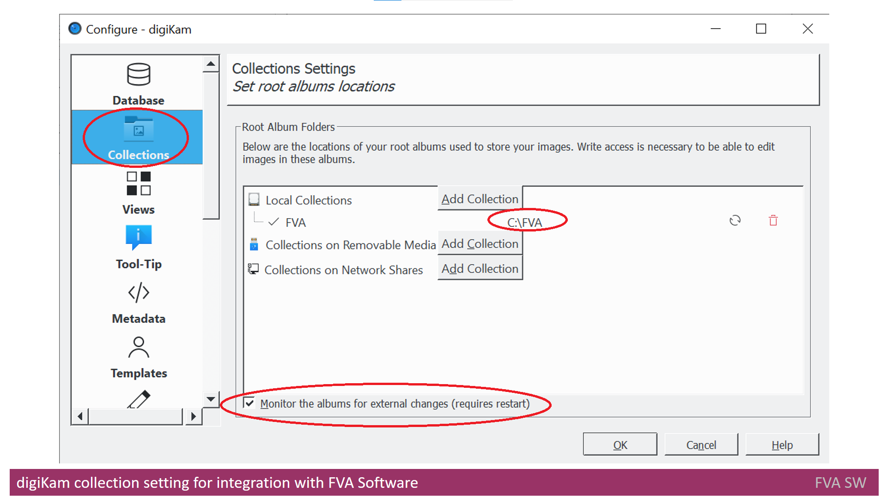
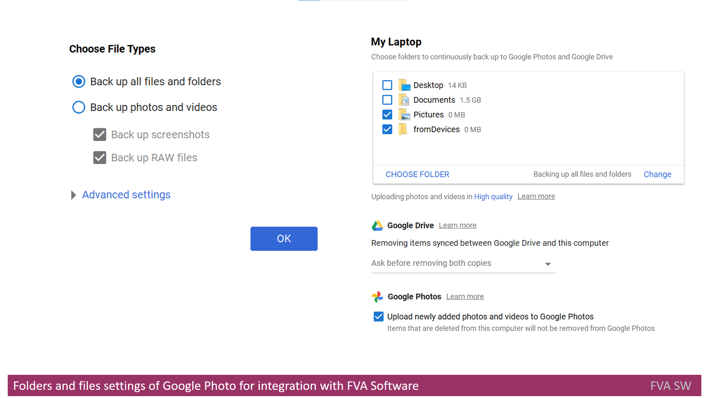

# Headline
What I learned as a Subject Matter Expert while creating my product

TBD

# Article description
TBD 

# Tags
TBD

# Content

## Multimedia IR systems
&nbsp;&nbsp; My first step in the role of an SME was getting to know what [Multimedia Data](./MultimediaData.md) is.
I started learning it as I understood that my whole photo album is [Multimedia Data](./MultimediaData.md) itself.
Then I realised that I need to use a solution to search in [Multimedia Data](./MultimediaData.md) - [Multimedia IR systems](./MULTIMEDIAIRSYSTEMS.md). 
However, there are many [Multimedia IR systems](./MULTIMEDIAIRSYSTEMS.md), and it was a long way to select one of them to start searching in a more efficient way.
Thus, several [Multimedia IR systems](./MULTIMEDIAIRSYSTEMS.md), that are present on the market and available for end users, were analyzed. 

I described the process of analysis and comparison for [Multimedia IR systems](./MULTIMEDIAIRSYSTEMS.md) [here](./MULTIMEDIAIRSYSTEMSANALYZE.md).
Consequently, I was able to choose the most suitable system for me.

## Metadata
&nbsp;&nbsp;&nbsp; A short usage of these systems gave me an understanding that [Multimedia IR systems](./MULTIMEDIAIRSYSTEMS.md) significantly rely on the [metadata](https://en.wikipedia.org/wiki/Metadata) as a main information source that is used for a search following different criteria, like device, time, location, etc.
Therefore, a presence and consistency of [metadata](https://en.wikipedia.org/wiki/Metadata) is very important for [Multimedia IR systems](./MULTIMEDIAIRSYSTEMS.md) to operate, as well as for other purposes [[21]](./REFERENCES.md).
Working experience with one of those systems shows that search results might be incomplete or even incorrect due to inconsistent or not-existing [metadata](https://en.wikipedia.org/wiki/Metadata).
[Metadata](https://en.wikipedia.org/wiki/Metadata) is usually kept inside of each file as a header with predefined format.
There are a plenty of [metadata](https://en.wikipedia.org/wiki/Metadata) formats like [Exif](https://en.wikipedia.org/wiki/Exif), [IPTC](https://en.wikipedia.org/wiki/International_Press_Telecommunications_Council) or [XMP](https://en.wikipedia.org/wiki/Extensible_Metadata_Platform).
 

&nbsp;&nbsp;&nbsp; The reasons for incorrect and absent [metadata](https://en.wikipedia.org/wiki/Metadata) are quite different - from not setting proper data on the device that takes photos to privacy issues. 
This resource [[22]](./REFERENCES.md) describes [metadata](https://en.wikipedia.org/wiki/Metadata) importance in more detail and there is information about other reasons for incorrect and absent [metadata](https://en.wikipedia.org/wiki/Metadata). 

## Examples of incorrect search results 
&nbsp;&nbsp;&nbsp; Let's consider two examples of incorrect search results. 
In the first case we tried to search for photos with existing **Geo** positions and to see them on a map. 
A search returned four photos taken near **Ghana**, marked by red circle.

&nbsp;&nbsp;&nbsp; In fact, nobody took photos near **Ghana**.

&nbsp;&nbsp;&nbsp; In the second case we searched for photos taken in **2011**. 
Literally, we got one video that was recognized as **March 2020**, underlined in red.

&nbsp;&nbsp;&nbsp; The system has provided such results due to incorrect [metadata](https://en.wikipedia.org/wiki/Metadata). 
 

## Multimedia Organizers
&nbsp;&nbsp;&nbsp; That being the case, I understood that [Multimedia IR systems](./MULTIMEDIAIRSYSTEMS.md) are not so effective without other tools, often called [Multimedia Organizers](./MULTIMEDIAORGANIZERS.md).
Usually, [Multimedia Organizers](./MULTIMEDIAORGANIZERS.md) provide automation for importing a new photo set into existing photo albums and it is not an implemented feature in [Multimedia IR systems](./MULTIMEDIAIRSYSTEMS.md).
In addition, they might identify and address some issues that shall be fixed before a user starts searching data using the [Multimedia IR systems](./MULTIMEDIAIRSYSTEMS.md).
    

## Integration 
&nbsp;&nbsp;&nbsp; Then I started studying [Multimedia IR systems](./MULTIMEDIAIRSYSTEMS.md) the **FVA Tool Set** shall integrate with. 
Integration with offline [Multimedia IR systems](./MULTIMEDIAIRSYSTEMS.md) is implemented through integration with [digiKam](https://www.digikam.org/about/), and integration with online [Multimedia IR systems](./MULTIMEDIAIRSYSTEMS.md) is implemented through integration with [Google Photos](https://en.wikipedia.org/wiki/Google_Photos).
As [Multimedia IR systems](./MULTIMEDIAIRSYSTEMS.md) performs a search by certain criteria, based on multimedia [metadata](https://en.wikipedia.org/wiki/Metadata), the FVA Software shall be able to work with the same multimedia [metadata](https://en.wikipedia.org/wiki/Metadata) to be integrated with [Multimedia IR systems](./MULTIMEDIAIRSYSTEMS.md).

### Integration with digiKam
&nbsp;&nbsp;&nbsp; For [digiKam](https://www.digikam.org/about/), I found that **Collections** setting shall be used to define how it is configured to search through [multimedia data](https://link.springer.com/referenceworkentry/10.1007%2F978-0-387-39940-9_1008). 
**Monitor the albums for external changes (requires restart)** setting shall be enabled. 
Taking into account this setting, [digiKam](https://www.digikam.org/about/) will pick up external changes in the collection as soon as proposed solution puts it in.

&nbsp;&nbsp;&nbsp; However, from **FVA Tool Set** side it is required to provide a possibility to configure storage in a way to be able to put [multimedia data](https://link.springer.com/referenceworkentry/10.1007%2F978-0-387-39940-9_1008) processed and to be integrated with [digiKam](https://www.digikam.org/about/).
Therefore, a separate [UI](https://en.wikipedia.org/wiki/User_interface) screen shall be created to ask a user what storage location, [digiKam](https://www.digikam.org/about/) should be used for incoming [multimedia data](https://link.springer.com/referenceworkentry/10.1007%2F978-0-387-39940-9_1008).

&nbsp;&nbsp;&nbsp; For example, a directory **C:\FVA** is selected for **Local Collections** as shown on the picture above. 
Therefore, when a user wants to integrate [multimedia data](https://link.springer.com/referenceworkentry/10.1007%2F978-0-387-39940-9_1008) after processing by FVA Tool Set, he/she shall be able to select **C:\FVA** directory as a directory in [UI](https://en.wikipedia.org/wiki/User_interface) to put the processed [multimedia data](https://link.springer.com/referenceworkentry/10.1007%2F978-0-387-39940-9_1008) in.
As soon as it is done, **FVA Tool Set** will put [multimedia data](https://link.springer.com/referenceworkentry/10.1007%2F978-0-387-39940-9_1008) into a selected directory and Multimedia IR system will be able to search through it.

### Integration with Google Photos
&nbsp;&nbsp;&nbsp; Integration with [Google Photos](https://en.wikipedia.org/wiki/Google_Photos) is implemented in the same way. 
First of all, it's worth noting that [Google Photos](https://en.wikipedia.org/wiki/Google_Photos) shall be configured to be integrated with **FVA Tool Set**. 
Thus, appropriate file types and folders shall be set up as in the figure below:

&nbsp;&nbsp;&nbsp; For example, **Pictures** and **fromDevices** directories are selected for the folders settings as shown above. 
It means that when a user wants to integrate [multimedia data]((https://link.springer.com/referenceworkentry/10.1007%2F978-0-387-39940-9_1008)) after processing by **FVA Tool Set**, he/she shall be able to select **fromDevices** or **Pictures** directory in [UI](https://en.wikipedia.org/wiki/User_interface) screen, as a directory to put processed [multimedia data](https://link.springer.com/referenceworkentry/10.1007%2F978-0-387-39940-9_1008) in. 
As soon as it is done, **FVA Tool Set** will put [multimedia data](https://link.springer.com/referenceworkentry/10.1007%2F978-0-387-39940-9_1008) into a selected directory and [Google Photos](https://en.wikipedia.org/wiki/Google_Photos) will be able to search through it as soon as it synchronizes [multimedia data](https://link.springer.com/referenceworkentry/10.1007%2F978-0-387-39940-9_1008).

# References
| # | Name                 | Source                | Release date           |  Author                 | Description   |
| - | ---------------------|---------------------- |----------------------- | ----------------------- |:-------------:|
| 1 | What is multimedia data?|[repo](./MultimediaData.md)| 2022            | Dmytro Nikulin |  |
| 2 | What are Multimedia IR systems?|[repo](./MultimediaIRSystems.md)|2022 | Dmytro Nikulin |  |
| 3 | Multimedia IR systems Analyze|[repo](./MultimediaIRSystemsAnalyze.md)|2022| Dmytro Nikulin |  |
| 4 | What are MultimediaOrganizers?|[repo](./MultimediaOrganizers.md)|2022 | Dmytro Nikulin | |

# Definitions, Acronyms, Abbreviations
| # | Abbreviation or Acronym | Definition     |
| - | ------------------------|:--------------:|
| 1 | [digiKam](https://www.digikam.org/about/)|digiKam is an advanced open-source digital photo management application that runs on Linux, Windows, and MacOS. The application provides a comprehensive set of tools for importing, managing, editing, and sharing photos and raw files. |
| 2 | [Exif](https://en.wikipedia.org/wiki/Exif)| Exchangeable image file [format](https://en.wikipedia.org/wiki/File_format) (officially Exif, according to JEIDA/JEITA/CIPA specifications) is a standard that specifies the [formats](https://en.wikipedia.org/wiki/File_format) for [images](https://en.wikipedia.org/wiki/Image), [sound](https://en.wikipedia.org/wiki/Sound), and ancillary tags used by [digital cameras](https://en.wikipedia.org/wiki/Digital_camera) (including [smartphones](https://en.wikipedia.org/wiki/Smartphone)), [scanners](https://en.wikipedia.org/wiki/Image_scanner) and other systems handling image and sound files recorded by digital cameras.|
| 3 | [exiftool](https://en.wikipedia.org/wiki/ExifTool)| ExifTool is a [free and open-source software](https://en.wikipedia.org/wiki/Free_and_open-source_software) program for reading, writing, and manipulating image, audio, video, and [PDF](https://en.wikipedia.org/wiki/Portable_Document_Format) [metadata](https://en.wikipedia.org/wiki/Metadata)|
| 4 | [Google](https://en.wikipedia.org/wiki/Google)| Google LLC is an American multinational technology company that specializes in Internet-related services and products, which include [online advertising technologies](https://en.wikipedia.org/wiki/Online_advertising), a [search engine](https://en.wikipedia.org/wiki/Search_engine), [cloud computing](https://en.wikipedia.org/wiki/Cloud_computing), software, and hardware.|
| 5 | [Google Photos](https://en.wikipedia.org/wiki/Google_Photos)| Google Photos is a [photo sharing](https://en.wikipedia.org/wiki/Photo_sharing) and [storage service](https://en.wikipedia.org/wiki/Cloud_storage) developed by [Google](https://en.wikipedia.org/wiki/Google). The service automatically analyzes photos, identifying various visual features and subjects. Users can search for anything in photos, with the service returning results from three major categories: People, Places, and Things.|
| 6 | [IPTC](https://en.wikipedia.org/wiki/International_Press_Telecommunications_Council) | The International Press Telecommunications Council (IPTC), based in [London](https://en.wikipedia.org/wiki/London), [United Kingdom](https://en.wikipedia.org/wiki/United_Kingdom), is a [consortium](https://en.wikipedia.org/wiki/Consortium) of the world's major [news agencies](https://en.wikipedia.org/wiki/News_agencies), other news providers and news industry vendors and acts as the global [standards body](https://en.wikipedia.org/wiki/List_of_technical_standard_organisations) of the news media.|
| 7 | [Multimedia data](https://link.springer.com/referenceworkentry/10.1007%2F978-0-387-39940-9_1008)| Multimedia in principle means data of more than one medium. It usually refers to data representing multiple types of medium to capture information and experiences related to objects and events. Commonly used forms of data are numbers, alphanumeric, text, images, audio, and video. In common usage, people refer a data set as multimedia only when time-dependent data such as audio and video are involved.|
| 8 | Multimedia IR| Multimedia Information Retrieval (MIR) is an organic system made up of Text Retrieval (TR); Visual Retrieval (VR); Video Retrieval (VDR); and Audio Retrieval (AR) systems. So that each type of digital document may be analyzed and searched by the elements of language appropriate to its nature, search criteria must be extended.|
| 9 | [metadata](https://en.wikipedia.org/wiki/Metadata)|Metadata is "data that provides [information](https://en.wikipedia.org/wiki/Information) about other data". In other words, it is "data about data." Many distinct types of metadata exist, including descriptive metadata, structural metadata, administrative metadata, reference metadata and statistical metadata. |
| 10| [UI](https://en.wikipedia.org/wiki/User_interface)| is the space where interactions between humans and machines occur. The goal of this interaction is to allow effective operation and control of the machine from the human end, whilst the machine simultaneously feeds back information that aids the operators' [decision-making](https://en.wikipedia.org/wiki/Decision-making) process|
| 11| [XMP](https://en.wikipedia.org/wiki/Extensible_Metadata_Platform)|The Extensible Metadata Platform (XMP) is an [ISO standard](https://en.wikipedia.org/wiki/List_of_International_Organization_for_Standardization_standards), originally created by [Adobe Systems Inc.](https://en.wikipedia.org/wiki/ADBE), for the creation, processing and interchange of standardized and custom metadata for digital documents and data sets. |
