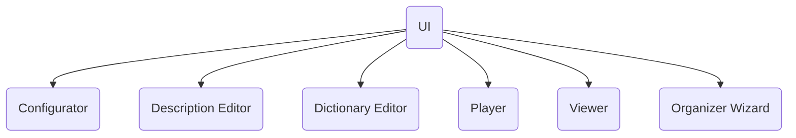
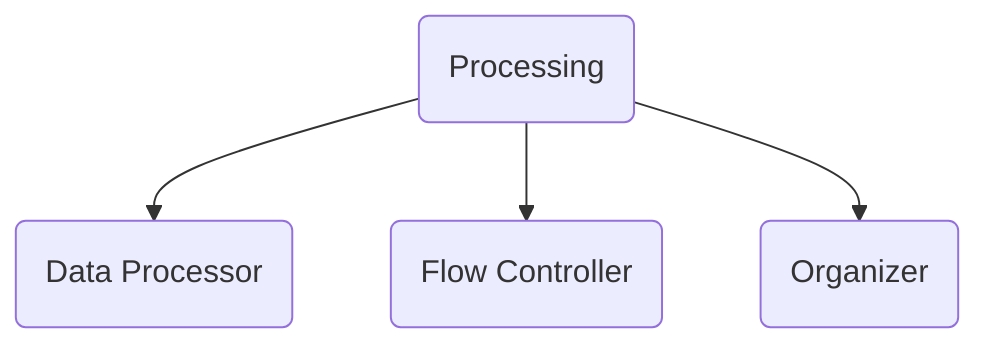
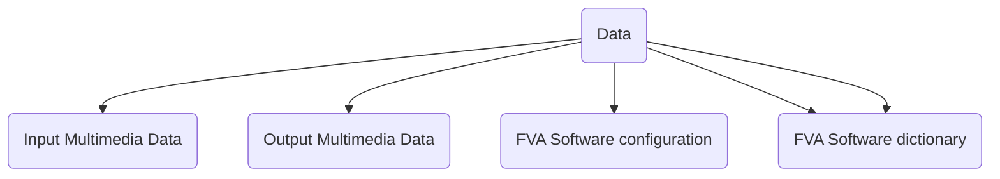

## Layers
TBD - describe why layered arch and why not SOA
 
### ([UI](https://en.wikipedia.org/wiki/User_interface))layer 
The photo album owner interacts with the system through the user interface ([UI](https://en.wikipedia.org/wiki/User_interface)) layer components. 
Basing on flow and user needs, [UI](https://en.wikipedia.org/wiki/User_interface) interacts with other components described later.

#### Configurator
The main function of the Configurator is to provide the settings to other components when requested and to save/load them to/from data layer.
Configurator works directly with saved in the disk settings. 
Instead, it uses FvaConfiguration.

#### Description Editor
TBD 

#### Dictionary Editor
TBD 

#### Player
TBD 

#### Viewer
TBD 

#### Organizer Wizard
TBD 

### Processing layer

The purpose of Flow Controller is to manage the action flows between [UI](https://en.wikipedia.org/wiki/User_interface) and the Data processor. The flows can be configured by the Configurator component.

Data Processor performs such actions as checking the multimedia [Metadata](https://en.wikipedia.org/wiki/Metadata) for presence and consistency and enriching it.

Organizer makes possible to start any command in separate process from command line or in separate thread.

## Data layer

### Input Multimedia Data
TBD

### Output Multimedia Data
TBD

### FVA Software configuration
TBD
The formatting strings shall be kept in a separated category

### FVA Software internal metadata
It is used to enrich Output Multimedia Data.   

### FVA Software dictionary 
FVA Software dictionary is data used along with FVA Software internal metadata.

## Logging 
All the main components interact with the Logging component to log the important events during processing.
During logging the logging component uses a "log level" setting got from FVAConfigurator.
The log shall be present as a CSV file with name of component it was created by.
The format of log file shall be following:
TBD

# Definitions, Acronyms, Abbreviations
| # | Abbreviation or Acronym | Definition     |
| - | ------------------------|:--------------:|
| 1 | CLT                     |Command Line Task |
| 2 | [Dictionary](https://en.wikibooks.org/wiki/A-level_Computing/AQA/Paper_1/Fundamentals_of_data_structures/Dictionaries)|A dictionary is a general-purpose data structure for storing a group of objects. A dictionary has a set of keys and each key has a single associated value. When presented with a key, the dictionary will return the associated value. |
| 3 | [JSON](https://www.json.org/json-en.html)| JSON (JavaScript Object Notation) is a lightweight data-interchange format.|
| 4 | [Multimedia data](https://link.springer.com/referenceworkentry/10.1007%2F978-0-387-39940-9_1008)| Multimedia in principle means data of more than one medium. It usually refers to data representing multiple types of medium to capture information and experiences related to objects and events. Commonly used forms of data are numbers, alphanumeric, text, images, audio, and video. In common usage, people refer a data set as multimedia only when time-dependent data such as audio and video are involved.|
| 5 | [metadata](https://en.wikipedia.org/wiki/Metadata)|Metadata is "data that provides [information](https://en.wikipedia.org/wiki/Information) about other data". In other words, it is "data about data." Many distinct types of metadata exist, including descriptive metadata, structural metadata, administrative metadata, reference metadata and statistical metadata. |
| 6 | [SOA](https://en.wikipedia.org/wiki/Service-oriented_architecture)|Service-oriented architecture (SOA) is an architectural style that supports service orientation. By consequence, it is as well applied in the field of [software design](https://en.wikipedia.org/wiki/Software_design) where services are provided to the other components by [application components](https://en.wikipedia.org/wiki/Application_components), through a [communication protocol](https://en.wikipedia.org/wiki/Communications_protocol) over a network. | 
