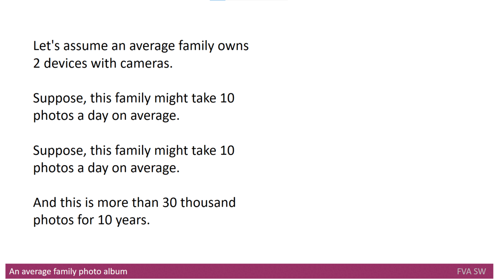

  

  
  
  
  
  
   
  
  
  
   
  
  
    
  
   
  
  
  
  
   
  
  
  
  
   
  
  
  
  

## Description
&nbsp;&nbsp;&nbsp; FVA Software is a convergent tool set in form of desktop applications to automate the process of importing the [Multimedia Data](./FVADocMD/MULTIMEDIADATA.md) (photo/audio/video)
into the [Multimedia IR systems](./FVADocMD/MULTIMEDIAIRSYSTEMS.md) like [digiKam](https://www.digikam.org/) , Google Photo, Apple Photo, [Synology Moments](https://www.synology.com/en-global/dsm/feature/moments) , etc. to make the multimedia more searchable and improve family photos.

&nbsp;&nbsp;&nbsp; The **main functions** (basing on user search needs) of FVA Software are: 
* To **automate the import** (with decreasing the probability of human factor influence on the process of importing new photos into the existing photo album);
* To **make photo albums more searchable** (that is driven by [Multimedia IR systems](./FVADocMD/MULTIMEDIAIRSYSTEMS.md)) by enriching the metadata (and improving its consistency) with minimal human involvement.

Despite many steps are automated, still human involvement is required.
 
The solution is oriented on **end users** only.
Only open source code/tools are used, as a product is **open source**.

## Features
- **Organizing the multimedia:** Organizing the [Multimedia Data](./FVADocMD/MULTIMEDIADATA.md) to be more searchable
- **Integration:** The system is integrated with online/offline [Multimedia IR systems](./FVADocMD/MULTIMEDIAIRSYSTEMS.md):
[digiKam](https://www.digikam.org/)  as Offline [Multimedia IR systems](./FVADocMD/MULTIMEDIAIRSYSTEMS.md) and 
[Synology Moments](https://www.synology.com/en-global/dsm/feature/moments)  as Online [Multimedia IR systems](./FVADocMD/MULTIMEDIAIRSYSTEMS.md) are now supported. 
- **Multimedia metadata gaps identification:** It identifies the gaps and tries to fill it up.
- **Text search:** It is possible to search by events, photo author, places, people using text search   
- **Configuration:** The system flow depends on configuration.

## User Scenarios 
- [Without FVA SW](https://youtu.be/_bLXFdIDZtA)
- [With FVA SW](https://youtu.be/-xnUsO7zW2s)
- [Checking the results of processing](https://youtu.be/NIsVYyioDnM)

## History
&nbsp;&nbsp;&nbsp; When I was a child, I used to observe the family photo album to look at my relatives who I have not seen in real life.
At that time, we had film cameras only and so the amount of photos was not so big.
Time changed and right now let's say almost everyone owns a camera or a smartphone with a camera or even both.
Because of that, the size of my photo album increased significantly. However, I do not think it is for me only.

&nbsp;&nbsp;&nbsp; Once Me and my friend decided to recall an event we both attended. We took my photo album and tried to search there. 
That time my album kept more than 30 thousand items inside. That search process looked like

&nbsp;&nbsp;&nbsp; Of course, we found nothing that time. Therefore, I started looking for a solution to search in [Multimedia Data](./FVADocMD/MULTIMEDIADATA.md) in an automatic way. 
What I found as a solution were the [Multimedia IR systems](./FVADocMD/MULTIMEDIAIRSYSTEMS.md). 
However, there are many [Multimedia IR systems](./FVADocMD/MULTIMEDIAIRSYSTEMS.md) and it was a long way to choose one of them to start searching in a way that is more efficient.
So, the [Multimedia IR systems](./FVADocMD/MULTIMEDIAIRSYSTEMS.md) were analyzed that are present on the market and available for end users. 

&nbsp;&nbsp;&nbsp; Finally, [digiKam](https://www.digikam.org/)  as Offline [Multimedia IR systems](./FVADocMD/MULTIMEDIAIRSYSTEMS.md) and [Synology Moments](https://www.synology.com/en-global/dsm/feature/moments)  as Online [Multimedia IR systems](./FVADocMD/MULTIMEDIAIRSYSTEMS.md) were selected to use.
Please notice they were selected based on author criteria only and there is no aim to advertise anyone.
You can find [here](./FVADocMD/MULTIMEDIAIRSYSTEMSANALYZE.md) a description of the process of analysis and comparison for [Multimedia IR systems](./FVADocMD/MULTIMEDIAIRSYSTEMS.md) I have made to choose the most suitable system for me.
   
&nbsp;&nbsp;&nbsp; Then I started using it...  What I found just immediately there, that the current [Multimedia IR systems](./FVADocMD/MULTIMEDIAIRSYSTEMS.md) do not provide a flexible and automated functionality to import the [Multimedia Data](./FVADocMD/MULTIMEDIADATA.md) into [Multimedia IR systems](./FVADocMD/MULTIMEDIAIRSYSTEMS.md).
However, it was not the last issue.
   
&nbsp;&nbsp;&nbsp; A short usage of these systems gave me understanding that [Multimedia IR systems](./FVADocMD/MULTIMEDIAIRSYSTEMS.md) significantly rely on the **multimedia metadata** as a main information source that is used for the search by device, time, location, etc.
Therefore, the presence and consistency of metadata is very important for [Multimedia IR systems](./FVADocMD/MULTIMEDIAIRSYSTEMS.md) to work and for other purposes [[21]](./FVADocMD/REFERENCES.md).
The working experience with one of those systems shows that the search results might not be full or even incorrect due to inconsistent or not-existing **multimedia metadata**.
   

&nbsp;&nbsp;&nbsp; The reasons for incorrect and absent **metadata** are rather different - from not setting proper data on the device that takes the photos to the privacy issues. 
This resource [[22]](./FVADocMD/REFERENCES.md) describes the **metadata** importance in more detail and there is information about other reasons for incorrect and absent **metadata**. 
Therefore, I understood that [Multimedia IR systems](./FVADocMD/MULTIMEDIAIRSYSTEMS.md) are not so effective without other tools, often called [Multimedia Organizers](./FVADocMD/MULTIMEDIAORGANIZERS.md).

Usually, [Multimedia Organizers](./FVADocMD/MULTIMEDIAORGANIZERS.md) provide automation for importing the new photo set into existing photo albums and it is not implemented feature in [Multimedia IR systems](./FVADocMD/MULTIMEDIAIRSYSTEMS.md).
In addition, they might identify and address some issues that shall be fixed before the user starts searching the data using the [Multimedia IR systems](./FVADocMD/MULTIMEDIAIRSYSTEMS.md). 
However, they do not implement any search function like search by emotions and it is expected.
You can find [here](./FVADocMD/MULTIMEDIAORGANIZERS.md) more information regarding **Multimedia Organizers**. 
   
&nbsp;&nbsp;&nbsp; Unfortunately, I did not find a [Multimedia Organizer](./FVADocMD/MULTIMEDIAORGANIZERS.md) that fully suited my needs (fixing problem metadata, working with **digiKam** and **Synology** etc.)
That is why I created my [own product](https://github.com/dimanikulin/fva) to cover my needs.
   
&nbsp;&nbsp;&nbsp; Honestly I did not expect that it would be so hard and meanwhile so interesting.

## Contributing
&nbsp;&nbsp;&nbsp;Still the development is in a hot stage and you are always welcome to contribute.
You can fill up this [form](https://docs.google.com/forms/d/1EI3oOumRnHxDjEYgV6PFB-AMfV5plLtuV2r5S8BYn_g/edit) to understand your needs in Multimedia search and organizing.
You can also leave an issue here [GitHub issues](https://github.com/dimanikulin/fva/issues) to request a feature or report a bug.
[Here](https://github.com/dimanikulin/fva/discussions) you can start a discussion.
   
&nbsp;&nbsp;&nbsp;Anyone can try themself in different roles to learn something new: 
- [As a product manager](./FVADocMD/LEARNT_AS_PM.md);
- [As a delivery manager](./FVADocMD/LEARNT_AS_DM.md);
- [As an application architect](./FVADocMD/LEARNT_AS_SA.md); 
- [As a software developer](../FVADocMD/LEARNT_AS_DEV.md).
- [As a subject matter expert](../FVADocMD/LEARNT_AS_SME.md). 
- [As a software tester you can download the installation packages](https://github.com/dimanikulin/fva/releases) that are published for Linux (x86-64), Mac and Windows (latest versions) to try it.
   

&nbsp;&nbsp;&nbsp;So there are many items to help the author in.
     

## Stay in touch
* [Twitter](https://twitter.com/DmytroNikulin)
* [LinkedIn](https://www.linkedin.com/in/dimanikulin/)
* [Author Telegram](https://t.me/dimanikulin79) 
* [Community Telegram](TODO) 

## Additional links
- [References to external documents like web resources, publication, patents etc. (applicable for all other documents)](FVADocMD/REFERENCES.md)
- [Definitions, Acronyms, Abbreviations](FVADocMD/DEFINITIONS.MD)
- [What is Multimedia Data?](FVADocX/MultimediaData.pptx)
- [What are Multimedia IR Systems?](FVADocX/MultimediaIRSystemOverview.pptx)
- [Multimedia IR Systems analyze](FVADocX/MultimediaIRSystemComparison&Analyze.pptx)
- [Multimedia Organizers](FVADocX/MultimediaOrganizeOverview.pptx)
