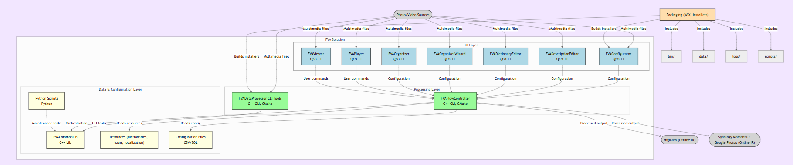

  

  
  
  
   
  
  
  
  
   
  
  
  
  
   
  
  
  
  

# Quick Links
- [Description](./README.md#description)
- [Capabilities](./README.md#capabilities)
- [Software Architecture Requirements](./README.md#software-architecture-requirements)
- [Software Architecture Views](./README.md#software-architecture-views)
- [Programming Languages](./README.md#programming-languages)
- [License](./README.md#license)
- [Dependencies](./README.md#dependencies)
- [Code Style](./README.md#code-style)
- [Code Documentation](./README.md#code-documentation)
- [Implementation Status](./README.md#implementation-status)
- [Contributing](./README.md#contributing)
- [Stay in touch](./README.md#stay-in-touch)
- [Definitions, Acronyms, Abbreviations](./README.md#definitions-acronyms-abbreviations) 

# Description
FVA Software (Photo-Video-Audio Software) is a convergent tool set in a form of desktop applications aimed at automating importing process of [Multimedia Data](https://github.com/dimanikulin/publications/blob/master/content/MultimediaData.md) (photo/audio/video)
into [Multimedia IR systems](https://github.com/dimanikulin/publications/blob/master/content/MultimediaIRSystems.md) like [digiKam](https://www.digikam.org/) 
,
 Google Photo, Apple Photo, [Synology Moments](https://www.synology.com/en-global/dsm/feature/moments) 
, 
etc. to make multimedia more fully-searchable as well as to refine family photos.

# Capabilities
- **Organizing the multimedia:** Organizing the [Multimedia Data](https://github.com/dimanikulin/publications/blob/master/content/MultimediaData.md) to be more searchable
- **Multimedia metadata gaps identification:** It identifies the gaps and tries to fill it up (enriching the metadata and improving its consistency with minimal human involvement).
- **Integration:** The system is integrated with online/offline [Multimedia IR systems](https://github.com/dimanikulin/publications/blob/master/content/MultimediaIRSystems.md):
[digiKam](https://www.digikam.org/)  as Offline [Multimedia IR systems](https://github.com/dimanikulin/publications/blob/master/content/MultimediaIRSystems.md) and 
[Synology Moments](https://www.synology.com/en-global/dsm/feature/moments)  as Online [Multimedia IR systems](https://github.com/dimanikulin/publications/blob/master/content/MultimediaIRSystems.md) are now supported.
- **Supporting text search for [Multimedia IR systems](https://github.com/dimanikulin/dimanikulin/blob/master/content/MultimediaIRSystems.md):** It is possible to search by events, photo author, places, people using text search 
- **Configuration:** The system flow depends on configuration.
- **Automating the import:** to decrease the probability of human factor influence on the process of importing new photos into the existing photo album;
Despite many steps are automated, still human involvement is required. 

# Software Architecture Requirements

## Constraints
This section lists [constrains](./docs/Constraints.md) and explanations for them. 

## Assumptions
This section lists all the assumptions with explanations for them. 
This is critical to do in order to cover all the gaps in the requirements.
| # | Assumption Description  | 
| - |:--------------:|
| 1 | It is assumed that the user, which the proposed solution is going to run under, has the write access to the [Google Photo](https://en.wikipedia.org/wiki/Google_Photos) (and other IR Multimedia systems) folder where [multimedia data](https://link.springer.com/referenceworkentry/10.1007%2F978-0-387-39940-9_1008) processed is going to be put in. | 
| 2 | User restarted the wizard after changing the configuration (because of feature of QTWizard and QTWizardPage) |

## Quality Attributes
This section lists quality attributes for target architecture.
So there are following Quality Attributes: **Conceptual Integrity**, **Maintainability**, **Reusability**, **Availability**, **Interoperability**, **Manageability**, **Performance**, **Reliability**, **Scalability**, **Security**, **Portability**, **Supportability**, **Testability**, **Learnability**, **Traceability**.

For more details please [see](./docs/QualityAttributes.md)

## Hardware requirements
TBD

# Software Architecture Views

## Context View
The context diagram below shows the solution bounds and its interactions with other objects and subjects.

The solution is used during import of new multimedia content from external devices to an existing user photo album. 

The photo album owner is the main and only user of the solution. 

The external devices might be: 
- the phones with a camera; 
- the tablets with a camera; 
- the photo/video cameras;
- external storages (e.g., hard drive or flash card) with multimedia data;
- etc.

Once the multimedia data from the external devices is processed, the solution interacts with integrated online and offline Multimedia systems.

## Functional View

The Layered Architecture shall be applied to the system. 
Following layers are considered:

For more details please [see](./docs/FunctionalView.md)

## Deployment View
The target installation folder shall have next folder structure:
* **#bin#** - a directory with all binaries (product one either third party);
* **#data#** - a directory to keep user populated dictionaries and application data;
* **#logs#** - a directory to keep the application logs. Each log file name shall start from name of process it was created by;
* **#scripts#** - a directory to keep all the scripts.

Installation must be possible at any target directory but not only in root folder.

TBD describe dependencies installed along with FVA Software.

TBD fvaParams.csv

## Source View

Was created with a help of [gitdiagram](https://gitdiagram.com/)

# Programming Languages                         
Now C++ and Python are considered as main languages to implement FVA Software.

TBD - to describe for which cases C++ and for which Python.

# License
we use 3-rd party code here TBD link
and own licence is TBD

# Dependencies
Only open source [code/tools](./docs/Dependencies.md) are used, as a product is **open source**.

There were other [dependencies](./docs/DependenciesOld.md) but they got outdated.

# Code Style
Please see [here](./docs/CodeStyle.md) for the rules to create and review the code.

# Code Documentation
Please see [here](./docs/CodeDocumentation.md) for the rules to document the code.

# Implementation status
As of now, I have the **implementation status** for the following components:
- [Data processor](./FVADataProcessor/IMPLEMENTATIONSTATUS.MD)
- [Configurator](./FVAConfigurator/IMPLEMENTATIONSTATUS.MD)
- [Dictionary editor](./FVADictionaryEditor/IMPLEMENTATIONSTATUS.MD)

These references will give you an overview of the implementation status for each respective component.

# Contributing

There are many items to help the author with.

You can fill in this [form](https://docs.google.com/forms/d/1EI3oOumRnHxDjEYgV6PFB-AMfV5plLtuV2r5S8BYn_g/edit) to understand your needs in Multimedia search and organizing.

You can also post an issue here [GitHub issues](https://github.com/dimanikulin/fva/issues) to request a feature or report a bug.

[Here](https://github.com/dimanikulin/fva/discussions) you can start a discussion.

You can also download [installation packages](https://github.com/dimanikulin/fva/releases) that are published for Linux (x86-64), Mac and Windows (latest versions) to try it.

[Community Telegram](https://t.me/+XqWdomi90-00Yzgy) 
  
# Definitions, Acronyms, Abbreviations
| # | Abbreviation or Acronym | Definition     |
| - | ------------------------|:--------------:|
| 1 | [Exif](https://en.wikipedia.org/wiki/Exif)| Exchangeable image file [format](https://en.wikipedia.org/wiki/File_format) (officially Exif, according to JEIDA/JEITA/CIPA specifications) is a standard that specifies the [formats](https://en.wikipedia.org/wiki/File_format) for [images](https://en.wikipedia.org/wiki/Image), [sound](https://en.wikipedia.org/wiki/Sound), and ancillary tags used by [digital cameras](https://en.wikipedia.org/wiki/Digital_camera) (including [smartphones](https://en.wikipedia.org/wiki/Smartphone)), [scanners](https://en.wikipedia.org/wiki/Image_scanner) and other systems handling image and sound files recorded by digital cameras.|
| 2 | [Google](https://en.wikipedia.org/wiki/Google)| Google LLC is an American multinational technology company that specializes in Internet-related services and products, which include [online advertising technologies](https://en.wikipedia.org/wiki/Online_advertising), a [search engine](https://en.wikipedia.org/wiki/Search_engine), [cloud computing](https://en.wikipedia.org/wiki/Cloud_computing), software, and hardware.|
| 3 | IR Multimedia Systems |multimedia information retrieval means the process of searching for and finding multimedia documents; the corresponding research field is concerned with building multimedia search engines. |
| 4 | [Multimedia data](https://link.springer.com/referenceworkentry/10.1007%2F978-0-387-39940-9_1008)| Multimedia in principle means data of more than one medium. It usually refers to data representing multiple types of medium to capture information and experiences related to objects and events. Commonly used forms of data are numbers, alphanumeric, text, images, audio, and video. In common usage, people refer a data set as multimedia only when time-dependent data such as audio and video are involved.|
| 5 | Multimedia IR| Multimedia Information Retrieval (MIR) is an organic system made up of Text Retrieval (TR); Visual Retrieval (VR); Video Retrieval (VDR); and Audio Retrieval (AR) systems. So that each type of digital document may be analyzed and searched by the elements of language appropriate to its nature, search criteria must be extended.|

---

